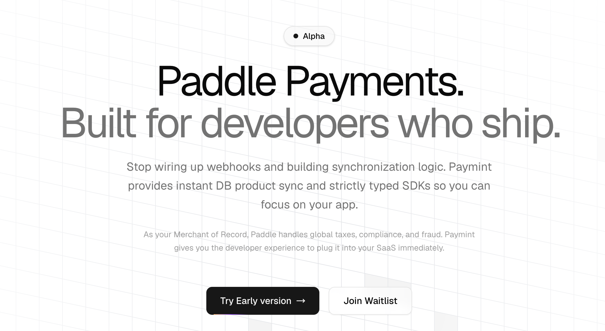
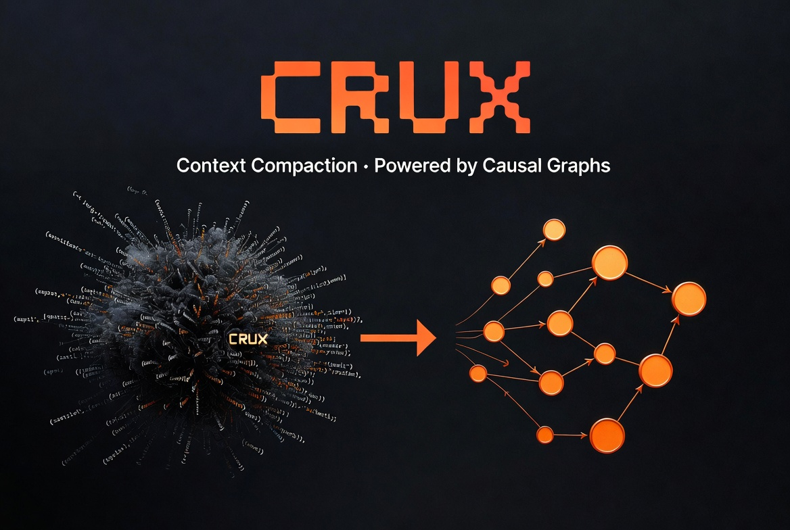
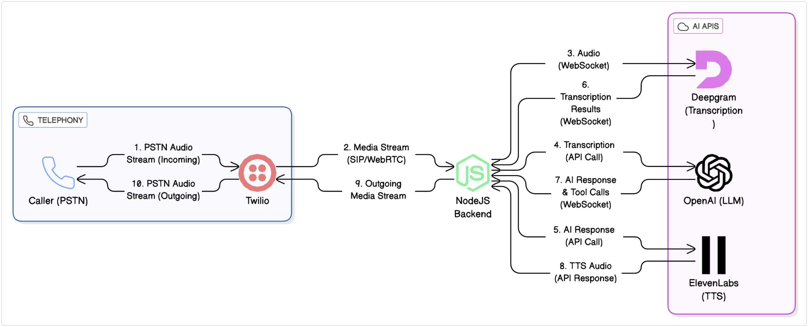

  
  
  <h1>👋 Hi, I'm Akash Panchal</h1>
  <h3>Senior Software Engineer | AI/ML Developer | Open Source Contributor</h3>
  
  
  
  
  
  
  
  **🚀 Always building. Always shipping. Always learning.**

---

## 🎯 About Me

🔹 **Current:** Senior Member of Technical Staff at Salesforce Marketing Cloud  
🔹 **Experience:** 9+ years building enterprise solutions at Salesforce, Amazon, McAfee, Broadcom  
🔹 **Expertise:** Distributed Systems, LLMs, Voice AI, Backend Development  
🔹 **Recognition:** Salesforce - Star Performer of the Quarter (Q3 2024)  

I'm passionate about solving complex problems at scale and building developer tools that make a difference.

---

## 🚀 Projects

### 💳 [**Paymint**](https://paymint.dev)

**Developer-first payment platform** that abstracts complex payment APIs into reusable components.

---

### 🧠 [**AI SDK Patterns**](https://ai-sdk-patterns.dev)

**Comprehensive resource** for AI SDK patterns, architectures, and best practices.

---

### 🛠️ [**Crux (Claude Code Plugin)**](https://github.com/akashp1712/claude-crux)

**AI context management system** that builds causal graphs to protect architectural decisions during long conversations.

---

### 📞 [**Call GPT: Generative AI Phone Calling**](https://github.com/akashp1712/call-gpt)

**Voice AI toolkit** for creating conversational phone systems with real-time voice synthesis and natural language understanding.

---

## 📊 GitHub Analytics

  
  

---

  
<strong>🚀 Always building. Always shipping. Always learning.</strong>

  
⭐ Building in public. Follow along on my journey!

  
  
  
  
  
  
  
  
  

