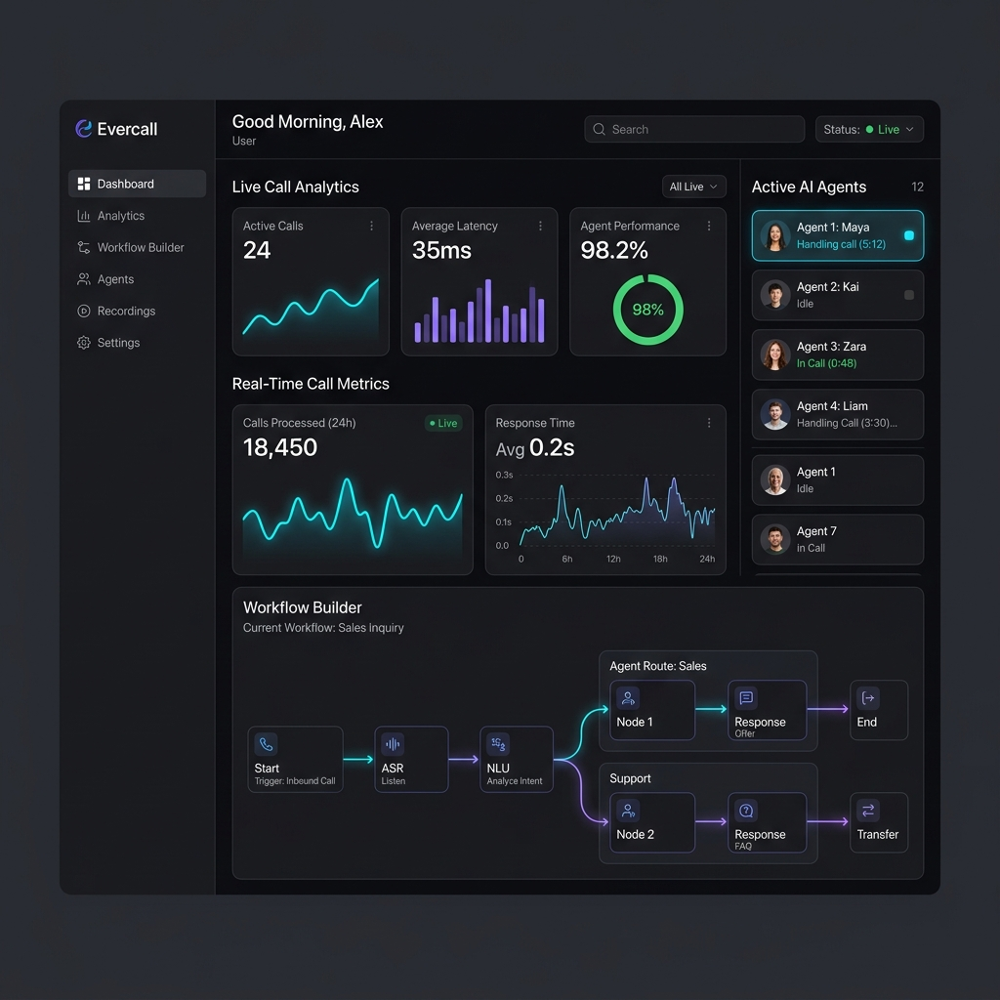

  

  <h1>Akash Panchal</h1>
  
<strong>I build production voice agents. Currently: Evercall.</strong>

  
When an Australian emergency plumber can't answer, we book the job. Day job: agent runtimes at Salesforce.

  
  
  

---

## What I work on

**[Evercall](https://evercall.app)** — divert for Australian emergency plumbers: triage, book the job, SMS the owner. Browser agent is live; the phone wire (DID → SIP → Neon) is what I'm closing now.

At Salesforce I work on agent runtimes. Before that: SMS platforms serving billions of messages, app-certification systems, home-network security. Nine-plus years across **Salesforce, Amazon, and McAfee**.

The writing is the part most tutorials skip: latency, barge-in, turn-taking, tools that must not lie — with runnable code.

---

## Writing

- **[Voice Agents: The Hard Problems](https://akashpanchal.com/articles/voice-agents-hard-problems)** — latency, barge-in, turn-taking
- **[LiveKit Voice Agents](https://akashpanchal.com/tutorials/livekit-voice-agents)** — the state machine you were about to write already exists
- **[Building Evercall](https://akashpanchal.com/building-evercall)** — one line per week that actually shipped

**→ [akashpanchal.com](https://akashpanchal.com)**

---

## The company

### [Evercall](https://evercall.app) — when they can't answer, we book the job

AU divert line for emergency plumbers. Not an "AI receptionist" landing page. The product is a booked job and an SMS to the owner.

`Voice AI` · `LiveKit` · `Python` · `Next.js`

Also shipped, parked: **[OneCue](https://onecue.app)** · **[VibeFrames](https://github.com/akashp1712/vibeframes)** · **[Paymint](https://paymint.dev)** · **[AI SDK Patterns](https://ai-sdk-patterns.dev)**

---

  Building in public. If the writing helps, say hi.

  
  

